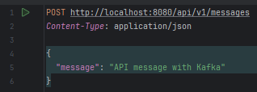

# Demo Kafka


### Description
This is a small project on how Kafka works. I am working on Windows 11, so the commands are bit different then the 
ones for [Linux](https://kafka.apache.org/quickstart). For Windows settings, you can follow 
this [video](https://www.youtube.com/watch?v=LX5LKBYHmyU). I have listed the needed commands below, just configure 
them with the destination of where you have extracted Kafka.

### Configuration
After you clone the repository, follow the commands below, by running them in different Windows PowerShell's in the directory 
where you have extracted Kafka.

Start the Zookeeper:
```
.\bin\windows\zookeeper-server-start.bat .\config\zookeeper.properties
```

Start the Kafka Broker:
```
.\bin\windows\kafka-server-start.bat .\config\server.properties
```

Consumer:
```
.\bin\windows\kafka-console-consumer.bat --topic demo-topic --from-beginning --bootstrap-server localhost:9092
```
After executing the last command, stay in the same PowerShell window to follow the messages we sent. 

In the project there is a default message that will run, once you start it. For custom messages you can use the below endpoint:
```
POST http://localhost:8080/api/v1/messages
```
Example API:<br>


After you finish the demo you should stop all 3 commands prompts(`Ctrl + C`) and delete the following folders: `logs`, `kafka-logs` 
and the content of `zookeeper`.

### Additional information

`Topics` - Producers publish messages to topics, and consumers read messages from the topic they are subscribe to. <br>
Partitions - Each topic can have multiple partitions
Offsets
`Producer` - Produces message to a Topic. <br>
`Consumer` - Consumes message from a Topic. <br>
`Consumer group` - 
`Broker` - A Kafka server is known as a Broker. The Broker is a bridge between Producers and Consumers. Stores the Topics. <br>
`Kafka Cluster` - Group of 1 or more Brokers. <br>
We can specify how many Clusters we want to create and how many Brokers we want in each Cluster. The number of Brokers 
in each Cluster does not have to be the same.
`Zookeeper` - Stores information about the Kafka Cluster. Manages the Kafka cluster


- [Kafka Tutorial - Core Concepts](https://www.youtube.com/watch?v=udnX21__SuU&list=PLN_xGGp_EzELV3J2Bp-kNkmI2Vor338NI&index=29&t=8s)
- [Apache Kafka in 6 minutes](https://www.youtube.com/watch?v=Ch5VhJzaoaI&list=PLN_xGGp_EzELV3J2Bp-kNkmI2Vor338NI&index=31)
- [What is Apache Kafka?](https://www.youtube.com/watch?v=vHbvbwSEYGo)
- [Kafka Tutorial - Spring Boot Microservices](https://www.youtube.com/watch?v=SqVfCyfCJqw&t=637s)
- [What is Zookeeper and how is it working with Apache Kafka?](https://www.youtube.com/watch?v=t0FDmj4kaIg)
- [Kafka in 100 Seconds](https://www.youtube.com/watch?v=uvb00oaa3k8)
- [Broker Cluster and Zookeeper in Kafka](https://www.youtube.com/watch?v=glOc3vH4iFw)
- [What is Apache Kafka Zookeeper](https://www.youtube.com/watch?v=EiuufG9fPR8)
- [What is Zookeeper?](https://www.youtube.com/watch?v=AS5a91DOmks)
- [064 ZooKeeper explained](https://www.youtube.com/watch?v=gZj16chk0Ss)
- [Apache Kafka® Tutorials for Beginners | What & Why Apache Kafka? Brief introduction | JavaTechie](https://www.youtube.com/watch?v=xGwzuz8F9k0&list=PLN_xGGp_EzELV3J2Bp-kNkmI2Vor338NI&index=33&t=15s)
- [Apache Kafka® Components & Architecture Detailed Explanation in 15 min | Javatechie](https://www.youtube.com/watch?v=HUAa1Yg9NlI)
- [Topics, partitions, and offsets in Kafka](https://www.youtube.com/watch?v=EA6haCVM06Y)


- [Apache Kafka Tutorial](https://www.javatpoint.com/apache-kafka)
- [Apache Kafka Architecture](https://www.javatpoint.com/apache-kafka-architecture)
- [How To Work With Apache Kafka In Spring Boot?](https://javatechonline.com/how-to-work-with-apache-kafka-in-spring-boot/)
